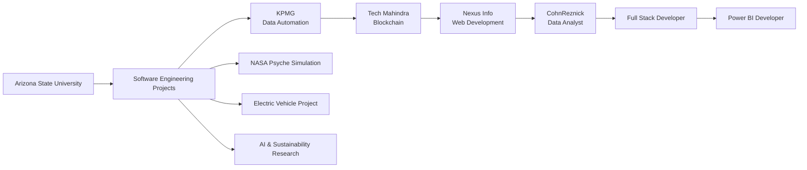

  

  <strong>Computer Science Graduate from Arizona State University</strong>

  Software Engineering • AI • Data Analytics • Cloud • Full-Stack Development • Business Intelligence

  

  

  

  

---

# 👨‍💻 About Me

I am a **Computer Science graduate from Arizona State University** passionate about building software that combines **engineering, artificial intelligence, cloud technologies, business intelligence, and data visualization** to solve real-world problems.

Currently, I work as a **Power BI Developer at CohnReznick**, where I design enterprise-scale analytics solutions, build advanced data models, and create interactive reporting experiences used across multiple business units.

My experience also spans **Full-Stack Development, Cloud Engineering, AI Automation, Blockchain, Scientific Visualization, and Data Engineering**, allowing me to approach products from both an engineering and business perspective.

---

# ✨ What My Work Contains

> *"Good visualizations don't just present data—they reveal insights that inspire better decisions."*

<b>Engineering + Data + AI + Cloud + Innovation</b>

<i>Creating scalable software that transforms complex data into intelligent solutions.</i>

---

# 🌍 Organizations I've Worked With

---

## 🚀 Featured Projects

---

### 🌐 Portfolio Website

🔗 **Live:** https://tanavjalan2003.github.io/Portfolio-Tanav/  
💻 **GitHub:** https://github.com/tanavjalan2003/Portfolio-Tanav

A modern, fully responsive personal portfolio showcasing my professional journey, projects, technical skills, certifications, and achievements through an engaging and interactive interface.

**Highlights**
- Professional experience & education timeline
- Interactive project showcase
- Recommendations & certifications
- Responsive design with smooth animations

**Tech Stack:** HTML • CSS • JavaScript • GitHub Pages

---

### 🚀 Psyche 1825 — Orbital of a Metal World

🔗 **Live:** https://tanavjalan2003.github.io/Psyche-Mission/  
💻 **GitHub:** https://github.com/tanavjalan2003/Psyche-Mission

An interactive scientific visualization inspired by NASA's Psyche mission that lets users explore the asteroid through immersive orbital and surface simulations.

**Highlights**
- 🌌 Orbital & Surface exploration modes
- 🛰️ Real-time orbital animation
- ⏱ Adjustable simulation speed
- 🎥 Interactive camera controls
- 📚 Educational visualization of planetary science

**Tech Stack:** JavaScript • HTML • CSS • Three.js

---

### 📈 Financial Planning — Mutual Funds

🔗 **Live:** https://tanavjalan2003.github.io/Financial-Planning-MF/  
💻 **GitHub:** https://github.com/tanavjalan2003/Financial-Planning-MF

A personal investment dashboard designed to simplify tracking and analyzing mutual fund investments through intuitive visualizations and portfolio analytics.

**Highlights**
- Portfolio performance tracking
- Profit & Loss analysis
- Investment growth visualization
- Asset allocation insights

**Tech Stack:** JavaScript • HTML • CSS • Charts

---

### 🎮 Video Game Sales Dashboard

🔗 **Live:** https://tanavjalan2003.github.io/Video-Game-Sales-Dashboard/  
💻 **GitHub:** https://github.com/tanavjalan2003/Video-Game-Sales-Dashboard

An interactive D3.js dashboard that visualizes global video game sales across platforms, genres, publishers, and years through rich exploratory analytics.

**Highlights**
- Interactive filtering
- Dynamic bar, line & scatter charts
- Regional sales comparisons
- Hover interactions & tooltips
- Story-driven data exploration

**Tech Stack:** D3.js • JavaScript • HTML • CSS

---

### 🏫 School Management System

💻 **GitHub:** *Add Repository Link*

A comprehensive desktop application developed to streamline school administration through automated record management and database integration.

**Highlights**
- Student & teacher management
- Attendance tracking
- Fee management
- Salary management
- Persistent MySQL database

**Tech Stack:** Python • MySQL

---

### 🏎️ AI Racing Game Simulator

💻 **GitHub:** *Add Repository Link*

An arcade-style racing simulator focused on AI-driven gameplay, adaptive mechanics, and real-time physics, built to explore game development and intelligent systems.

**Highlights**
- AI-controlled traffic
- Dynamic scoring system
- Real-time camera tracking
- Custom maps & obstacles
- Smooth gameplay mechanics

**Tech Stack:** Python • Pygame

---

### ⚡ Electric Vehicle Conversion (EPICS)

A multidisciplinary engineering project focused on converting a gasoline-powered vehicle into a fully functional electric vehicle as part of ASU's EPICS program.

**Highlights**
- Battery & motor integration
- Powertrain redesign
- Energy-efficiency analysis
- Safety validation
- Sustainable engineering

**Tech Stack:** Engineering Design • Electrical Systems • CAD

---

### 🌊 Microbots for Water Pollution

Research exploring autonomous microbot systems capable of removing microplastics and pollutants from water while supporting environmental sustainability.

**Highlights**
- Autonomous microbot concepts
- Environmental impact analysis
- Sustainable engineering
- UN Sustainable Development Goals

**Tech Stack:** Research • Robotics • Environmental Engineering

---

### 🌳 Mechanical Trees — Carbon Capture Research

A sustainability-focused research project investigating mechanical tree technology for large-scale atmospheric carbon capture.

**Highlights**
- Carbon capture systems
- Climate engineering
- Scalability analysis
- Environmental research

---

**Tech Stack:** Sustainability Research • Engineering Analysis

## 🛠️ Tech Stack

### Programming Languages

### Frameworks & Development

### Databases & Analytics

**Also:** Power BI • DAX • Power Query • SQL • Microsoft Fabric • ETL Pipelines

### Cloud & Tools

---

# 🗺️ My Journey

---

# 🏆 Achievements

🏅 Cum Laude Graduate

🥈 2nd Place — Zoom AI Spark Challenge ($2,000)

🎓 NaMU Scholarship Recipient

🏆 SUN Award Recipient

👑 Mr. Phoenix 2024

📚 Multiple Dean's List Honors

---

# 📈 GitHub Analytics

---

# ⚡ Fun Fact

I enjoy building everything from **enterprise analytics platforms and cloud applications to scientific simulations and AI-powered software**, combining engineering with creativity to solve meaningful real-world challenges.
