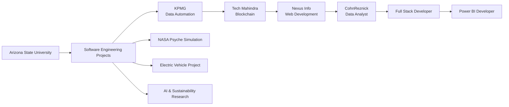

  

  <strong>Computer Science Graduate from Arizona State University</strong>

  Software Engineering • AI • Data Analytics • Cloud • Full-Stack Development • Business Intelligence

  

  

  

  

---

# 👨‍💻 About Me

I am a **Computer Science graduate from Arizona State University** passionate about building software that combines **engineering, artificial intelligence, cloud technologies, business intelligence, and data visualization** to solve real-world problems.

Currently, I work as a **Power BI Developer at CohnReznick**, where I design enterprise-scale analytics solutions, build advanced data models, and create interactive reporting experiences used across multiple business units.

My experience also spans **Full-Stack Development, Cloud Engineering, AI Automation, Blockchain, Scientific Visualization, and Data Engineering**, allowing me to approach products from both an engineering and business perspective.

---

# ✨ What My Work Contains

> ## 💙 My Engineering Philosophy
>
> *"Great software isn't just powerful—it should be scalable, intuitive, and built to solve meaningful problems."*

<b>Engineering + Data + AI + Cloud + Innovation</b>

<i>Creating scalable software that transforms complex data into intelligent solutions.</i>

---

# 🌍 Organizations I've Worked With

---

# 🚀 Featured Projects

### 🚀 NASA Psyche Mission Explorer

Interactive visualization of NASA's Psyche asteroid mission featuring orbital simulations, scientific visualization, and immersive educational experiences.

**Tech:** JavaScript • Three.js • WebGL

---

### ⚡ Electric Vehicle Conversion

Engineering project converting a gasoline-powered vehicle into an electric vehicle through battery integration, motor redesign, and sustainable engineering principles.

---

### 🌊 Microbots for Water Pollution

Research focused on autonomous microbot systems for removing microplastics and pollutants from water while supporting UN Sustainable Development Goals.

---

### 🌳 Mechanical Trees Research

Research project analyzing atmospheric carbon capture systems and scalable environmental engineering technologies.

---

### 📊 Enterprise Power BI Analytics

Designed enterprise dashboards using Power BI, DAX, SQL, and Microsoft Fabric supporting analytics across 12 business units and 200+ users.

---

### 🎮 AI Racing Game

Developed an AI-powered racing game with adaptive gameplay, reinforcement learning concepts, and real-time physics.

---

## 🛠️ Tech Stack

### Programming Languages

### Frameworks & Development

### Databases & Analytics

**Also:** Power BI • DAX • Power Query • SQL • Microsoft Fabric • ETL Pipelines

### Cloud & Tools

---

# 🗺️ My Journey

---

# 🏆 Achievements

🏅 Cum Laude Graduate

🥈 2nd Place — Zoom AI Spark Challenge ($2,000)

🎓 NaMU Scholarship Recipient

🏆 SUN Award Recipient

👑 Mr. Phoenix 2024

📚 Multiple Dean's List Honors

---

# 📈 GitHub Analytics

---

# ⚡ Fun Fact

I enjoy building everything from **enterprise analytics platforms and cloud applications to scientific simulations and AI-powered software**, combining engineering with creativity to solve meaningful real-world challenges.
